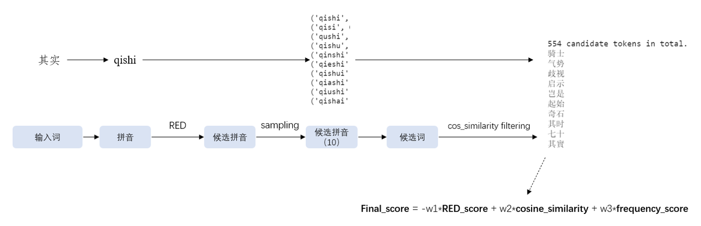

## Confusor

> A module for generating the word-level (i.e., 1 or more words) confusion-set for a longer phrase.


### Overview

**Confusor is a retrieval-based module for the word-level confusion-set generation.** 
This module retrieves the required confusion-set for a target word from more than 12 million Chinese words. 


Confusor applies the two-step retrieval: **pinyin retrieval** and **word retrieval**. In the pinyin retrieval step, confusor retrieves most similar pinyin sequences from a large pinyin sequence corpus by the **refined edit distance (RED) algorithm**, which uses two manually-set transition matrices to model the effects of typical errors such as fuzzy tones and keyboard mistouch. Then the set of candidate words can be easily obtained. In the word retrieval step, confusor further computes a weighted score to retrieve words in a small confusion-set from the large set of candidate words.


However, the pinyin retrieval step is time-consuming. Three retrieval methods are proposed to address this issue: **two-stage retrieval, DCC retrieval, beam search retrieval.**

See `/docs/confset.pdf` for more details.


### Usage

#### 1. Preparing

+ Set the path to the temporary data directory.
  + in `confusor/preprocess_tx_embeddings.py`
+ Select the version of tx_embeddings and download tar-files.
  + call `untar()` in `confusor/preprocess_tx_embeddings.py`
  + a new directory called `tx_embddings` will be created
+ Call the script to generate bucketing corpus-file by word-length.
  + call `bucket_by_length()` in `confusor/preprocess_tx_embeddings.py`
+ Call the script to generate scores for `input_sequence`
  + call `main()` in `confusor/preprocess_red_matrix.py`
  + a new directory called `score_data` will be created
+ TODO: more steps for other inter-mediate files.


#### 2. Initialization

```
conf = Confusor(method='beam', pinyin_sample_mode='special', token_sample_mode='sort', weight=[1, 0.5, 1])
```

**Parameters:**

| Param                | Note                              | Option                                 |
| -------------------- | --------------------------------- | -------------------------------------- |
| `method`             | pinyin sequence retrieval method. | 'baseline', 'two-stage', 'dcc', 'beam' |
| `pinyin_sample_mode` | pinyin sequence sampling mode.    | 'sort', 'random', 'special'            |
| `token_sample_mode`  | word sampling mode.               | 'sort', 'random'                       |

Use `weight` to adjust the weight of the RED score, cosine similarity score and frequency score for a word respectively.

See [confusor.py](confusor/confusor_v2.py) for more details.


#### 3. Call the Confusor!

```
conf('世界')
```

Then you can get the confusion-set of size 10 as follows:

```
['实际', '视界', '世纪', '世届', '十届', '十界', '视觉', '事界', '四届', '时节']
```

### Datasets

Datasets come form this [repo](https://github.com/anonymous/realworld_chinese_typos), will be published soon after anonymous phase.
+ `.tsv` for datasets with pair-wise sentences: 
  + train and test: `<error_sentence>\t<correct_sentence>`
+ `.dcn.txt` for datasets with DCN-form: (tokens are separated by blanks)
  + train: `(pid=test-01)\t<error_sentence>\t<correct_sentence>\t<attention_ids>\t<pinyin_ids_for_err>`
  + test: `(pid=test-01)\t<error_sentence>`
+ `.sighan.txt.` for datasets with SIGHAN-form:
  + test: `(pid=test-01)\t<error_sentence>`


### Resources
> Uploading...

+ Trained model files
  + TODO.
+ Embeddings for 12 million n-grams
  + from the released [tencent embedding](https://ai.tencent.com/ailab/nlp/en/embedding.html)
+ Src for IME
  + the mapping dict for pinyin candidates [here](data/input_candidates.google.json)
  + the mapping dict for pinyin-similar relations [here](data/pinyin_mapping.json)
  + the char-level confusion set from @ACL2020SpellGCN/[SpellGCN](https://github.com/ACL2020SpellGCN/SpellGCN) for this [paper](https://doi.org/10.18653/v1/2020.acl-main.81)
+ Datasets
  + check [DCN](exp/data/cn/Wang271k/) dataset at @destwang/[DCN](https://github.com/destwang/DCN).
  + check [CCTC](exp/data/cn/cctc/) dataset at @destwang/[CTCResources](https://github.com/destwang/CTCResources)
  + we release half of the RFD dataset [here](exp/data/cn/findoc/) in this repo, the rest samples are waiting for desensitization.
  + this [paper](https://doi.org/10.18653/v1/P19-1578) also proposed a char-level confusion set (not used in our work, later.)


### Base Models
> For evaluating the performance, this repo also re-produce several top-rated CSC models.


#### DCN
> Among the CSC models without pretraining on external corpus, [**DCN**](exp/dcn/README.md) is the top CSC model using dynamic connections between candidates on adjacent tokens.           

**train**

``` bash
# sh train.sh

set -v
set -e

TASK=sighan15
MODEL_DIR=dcn_models/wsw5_train_model_192/

INPUT_FILE=../data/cn/$TASK/${TASK}_test.sighan.txt
DCN_FILE=../data/cn/$TASK/${TASK}_test.dcn.txt
OUTPUT_FILE=$MODEL_DIR/output_${TASK}.txt
MAX_LENGTH=192
BATCH_SIZE=4

CUDA_VISIBLE_DEVICES=1 python predict_DCN.py \
    --model $MODEL_DIR \
    --input_file $INPUT_FILE \
    --output_file $OUTPUT_FILE \
    --batch_size $BATCH_SIZE \
	--max_len $MAX_LENGTH 


python evaluate.py $DCN_FILE $OUTPUT_FILE 
```

**infer**

```bash
# sh predict.sh

set -v
set -e

TASK=sighan15
MODEL_DIR=dcn_models/wsw5_train_model_192/

INPUT_FILE=../data/cn/$TASK/${TASK}_test.sighan.txt
DCN_FILE=../data/cn/$TASK/${TASK}_test.dcn.txt
OUTPUT_FILE=$MODEL_DIR/output_${TASK}.txt
MAX_LENGTH=192
BATCH_SIZE=4

CUDA_VISIBLE_DEVICES=1 python predict_DCN.py \
    --model $MODEL_DIR \
    --input_file $INPUT_FILE \
    --output_file $OUTPUT_FILE \
    --batch_size $BATCH_SIZE \
	--max_len $MAX_LENGTH 


python evaluate.py $DCN_FILE $OUTPUT_FILE 

```

#### MLM-Phonetic
> On the other hand, among the best-performing CSC models with pretraining, we take [**MLM-Phonetic**](exp/phonetic_ernie/README.md) as one of the base models. It is an end-to-end frame-work for CSC with phonetic pre-training, which applies the ``Noisy-Pinyin'' method to help clustering similarly pronounced characters with their corresponding pinyin tokens.

**train**

```bash
# sh run_train.sh

task=wsw5_dcn_train_192

# TRAIN_DIR=../data/cn/Wang271k_augc
# TEST_PATH=../data/cn/rw/rw_test.dcn.txt
# --extra_test_ds_file $TEST_PATH

TRAIN_DIR=../data/cn/Wang271k_augw

CUDA_VISIBLE_DEVICES=5 python train.py \
  --epochs 1 \
  --batch_size 4 \
  --learning_rate 5e-5 \
  --max_seq_length 192 \
  --model_name_or_path ernie-1.0 \
  --logging_steps 500 \
  --save_steps 50000 \
  --output_dir ./checkpoints/$task/ \
  --extra_train_ds_dir $TRAIN_DIR
```

**export the model after trained**
```bash
# sh run_export_model.sh

task=wsw5_dcn_train_192

python export_model.py \
  --params_path checkpoints/$task/best_model.pdparams \
  --output_path infer_model/$task/static_graph_params

```

**infer with the exported model**
```bash
# sh run_predict.sh

task=wsw5_dcn_train_192

sighan_test=../data/cn/sighan15/sighan15_test.tsv
cctc_test=../data/cn/cctc/cctc_test.tsv
findoc_test=../data/cn/findoc/findoc_test.tsv

CUDA_VISIBLE_DEVICES=5 python predict.py \
  --model_file ./infer_model/$task/static_graph_params.pdmodel \
  --params_file ./infer_model/$task/static_graph_params.pdiparams \
  --test_file $sighan_test

CUDA_VISIBLE_DEVICES=5 python predict.py \
  --model_file ./infer_model/$task/static_graph_params.pdmodel \
  --params_file ./infer_model/$task/static_graph_params.pdiparams \
  --test_file $cctc_test

CUDA_VISIBLE_DEVICES=5 python predict.py \
  --model_file ./infer_model/$task/static_graph_params.pdmodel \
  --params_file ./infer_model/$task/static_graph_params.pdiparams \
  --test_file $findoc_test
```


#### T5
> Finally, we take [**T5**](exp/t5/README.md) as an example model standing for generative models.

**train**

```bash
# sh train.sh

# TRAIN_PATH=../data/cn/Wang271k/dcn_train.tsv
TRAIN_PATH=../data/cn/Wang271k_augw/dcn_train.augw.tsv
TEST_PATH=../data/cn/rw/rw_test.tsv

MODEL_PATH=./t5_models/wsw_train_model_192
MODEL_NAME=Langboat/mengzi-t5-base

CUDA_VISIBLE_DEVICES=6 python train.py \
  --model_name_or_path $MODEL_NAME \
  --train_path $TRAIN_PATH \
  --test_path $TEST_PATH \
  --logging_steps 1000 \
  --warmup_steps 1000 \
  --eval_steps 5000 \
  --epochs 5 \
  --batch_size 4 \
  --max_len 192 \
  --save_dir $MODEL_PATH \
  --do_train \
  --do_eval
```

**infer**

```bash
# TODO
```